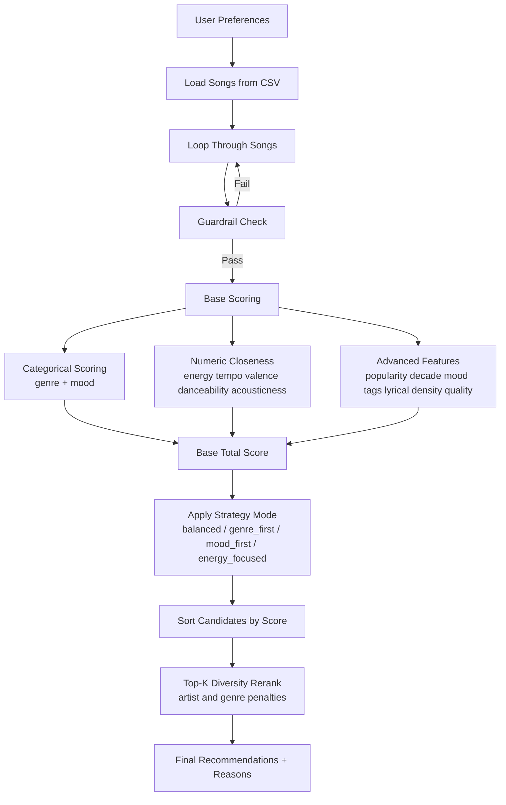

# 🎵 Music Recommender Simulation

## Project Summary
In this project, I built a music recommender that ranks songs based on how well they match a user taste profile. I started with the baseline logic, then iteratively expanded both the data model and scoring design to make recommendations more explainable and testable.

My final version does four major things beyond the starter:
- I expanded the song dataset with advanced attributes.
- I implemented richer scoring rules that include both categorical matching and numeric closeness.
- I added switchable ranking modes (strategy-style behavior).
- I added diversity/fairness reranking so top results are less repetitive.

I used AI assistance to accelerate brainstorming and refactoring, but I validated each major change by running the app and tests in terminal.

---

## How The System Works
My recommender is a content-based ranking system. I compare each song in the catalog against a user profile, calculate a score with interpretable reasons, and then rank songs by score.

### What Features I Use Per Song
I use the starter features plus advanced features I added:
- Base: genre, mood, energy, tempo_bpm, valence, danceability, acousticness
- Advanced: popularity, release_decade, mood_tags, lyrical_density, production_quality

### What My User Profile Stores
My user profile (dictionary style in CLI mode) can include:
- Core taste: genre, mood, energy
- Optional numeric targets: tempo_bpm, valence, danceability, acousticness
- Advanced targets: target_popularity, preferred_decade, preferred_mood_tags, target_lyrical_density, target_production_quality
- Behavior controls: ranking mode and diversity penalty settings

### How I Compute Scores
I designed scoring as layered logic:
1. I award points for categorical alignment (genre and mood matches).
2. I award closeness points for numeric features using a bounded distance function.
3. I add advanced-feature points:
   - popularity closeness
   - decade preference (exact/adjacent)
   - mood-tag overlap
   - lyrical-density closeness
   - production-quality closeness
4. I apply a mode-specific strategy bonus.
5. I rerank top candidates with diversity penalties to reduce repeated artists and repeated genres.

### Why I Added Explanations
Every recommendation carries reasons (for example, genre match, energy alignment, mood-tag match). I did this so I can debug the model and explain outcomes to a non-technical user.

### Final Algorithm Recipe (Plain English)
- Loop through all songs.
- Skip songs that violate guardrails.
- Score each song with base + advanced + strategy components.
- Sort by score.
- Build top-k list with diversity penalties applied during selection.
- Return top songs with score and reason text.

### Strategy Modes I Implemented
- balanced: no extra directional bias
- genre_first: extra bonus for preferred genre
- mood_first: extra bonus for preferred mood
- energy_focused: extra bonus for energy closeness

### Diversity Rule I Implemented
When selecting top results, I reduce a candidate's adjusted score if its artist or genre already appears in previously selected songs.

Adjusted score rule:

adjusted_score = base_score - (artist_repeat_count × artist_penalty) - (genre_repeat_count × genre_penalty)

This helps me prevent one artist from dominating the top recommendations.

### Mermaid Flowchart


### Potential Bias Note
I expected that whichever feature got the highest weight would dominate outcomes, and that happened in practice. In my experiments, energy-heavy logic often pulled energetic tracks upward across very different profiles. This means my system can over-prioritize energetic songs even when mood or genre intent suggests a calmer result.

---

## Getting Started

### Setup
1. Create a virtual environment (optional):

```bash
python -m venv .venv
source .venv/bin/activate
```

2. Install dependencies:

```bash
pip install -r requirements.txt
```

3. Run the app:

```bash
python -m src.main
```

### Running Tests

```bash
pytest -q
```

I also added a tests bootstrap file so plain pytest works without extra environment variables.

---

## Experiments You Tried
I treated this like an iterative engineering process, not a one-shot coding task.

### Experiment Set 1: Baseline Profile Behavior
I began with a default profile (pop, happy, energy around 0.8). I checked whether top songs looked intuitively correct and whether reason strings matched the actual score components. This gave me a baseline for later comparisons.

### Experiment Set 2: Diverse User Profiles
I ran multiple profile styles to validate separation:
- High-Energy Pop
- Chill Lofi
- Deep Intense Rock
- Warm Up Workout

I looked for whether outputs shifted in expected ways (for example, high-energy users receiving faster and more danceable tracks).

### Experiment Set 3: Adversarial and Edge Cases
I built a dedicated evaluation script to stress the scorer with contradictory inputs:
- High Energy + Sad
- Sad Pop Music
- Impossible Preference
- Non-Danceable House
- 200 BPM Acoustic Jazz

This helped me identify where my score components conflict and where the model chooses compromise songs.

### Experiment Set 4: Logic Sensitivity
I tested sensitivity by changing weight emphasis (genre vs energy) and observed ranking shifts. The key result was that small scoring changes can significantly change top results.

### Experiment Set 5: Strategy Mode Comparison
I implemented mode switching and compared top-3 outputs per mode in terminal:
- balanced
- genre_first
- mood_first
- energy_focused

This confirmed my modular design was doing real work, not just cosmetic branching.

### Experiment Set 6: Diversity and Fairness Reranking
I added artist and genre penalties in top-k selection to reduce repeated artists/genres. I then checked whether diversity improved without making results nonsensical.

---

## Limitations and Risks
- My dataset is very small, so coverage is limited and repetition is unavoidable.
- Some genres and moods have very few examples, so ranking can be unstable for niche profiles.
- I still do not model lyrical semantics, language, artist history, or user session context.
- The model can look confident in contradictory preference situations even when no true match exists.
- Feature weighting can create filter bubbles if one signal (like energy) becomes too dominant.

I discuss these limitations more formally in the model card.

---

## Reflection
My biggest learning was that recommendation quality is not only about adding more features; it is about designing trade-offs carefully. I saw that tiny logic changes can move a song from first place to third place, which taught me how sensitive ranking systems are to scoring assumptions.

AI tools helped me prototype faster, especially for brainstorming edge cases, strategy structures, and documentation drafts. But I had to verify everything by running tests, checking terminal output, and reading score reasons line by line. What surprised me most is that even simple point-based logic can feel "smart" when outputs align with user intent. If I continue this project, I will focus on better data coverage, stronger fairness controls, and user-configurable recommendation goals (strict genre mode vs mood-first mode).
